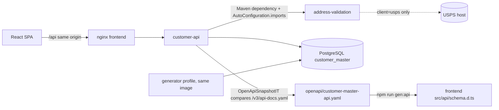

# Customer Master (web)

A containerized re-implementation of the IBM i Customer Master application: customer search and list, detail maintenance, the USA state prompt, USPS address standardization, and data and test-data provisioning. It runs on Java 21 / Spring Boot 3.5.16, PostgreSQL 18.6 and React 19 + TypeScript 5.9.

The IBM i members in [`../5250_Subfile`](../5250_Subfile), [`../USPS_Address`](../USPS_Address), [`../Service_Pgms`](../Service_Pgms), [`../BASE36`](../BASE36) and [`../Copy_Mbrs`](../Copy_Mbrs) are unchanged and serve as the behavioural specification. IBM i mechanisms (indicators, subfiles, message queues, data areas, binding directories, job submission) are replaced with standard web, Java and PostgreSQL constructs, not emulated.

The original application is described in [`../5250_Subfile/README.md`](../5250_Subfile/README.md) and [`../USPS_Address/Readme.md`](../USPS_Address/Readme.md). Where those readmes and the source code disagree, the source behaviour is built and the difference is recorded in [`docs/deviations-and-open-questions.md`](docs/deviations-and-open-questions.md).

## Contents

- [Architecture](#architecture)
- [Running it](#running-it)
- [Loading test data](#loading-test-data)
- [Address standardization](#address-standardization)
- [Running the test suites](#running-the-test-suites)
- [Platform notes](#platform-notes)
- [Documents](#documents)
- [Evidence statement](#evidence-statement)

## Architecture



- **Layers.** The API is layered controller → service → repository. Business rules (field validation, normalization, the Edit_Address mapping, id allocation) live in services; controllers only map DTOs, and React components only render and collect input.
- **Address module.** `backend/address-validation` is a separate Maven module behind the `AddressValidationClient` interface. It knows the USPS contract and nothing about customers. A deterministic stub is the default; a USPS Web Tools XML client is optional.
- **Identity.** Stateless HTTP Basic authentication with two roles, `INQUIRY` and `MAINTENANCE`, enforced by the API. `MAINTENANCE` implies `INQUIRY`. The browser keeps credentials in memory only and reaches the API through the same origin.
- **Errors and messages.** Every error is RFC 9457 `application/problem+json` carrying a message code derived from the CUSTMSGF message file (`DEMnnnn`) or added for web conditions (`APPnnnn`). The whole catalog is served by `GET /api/messages`, so the UI bundles no message text.
- **Concurrency.** Updates are conditional on a row version; a stale update answers 409 DEM1002 with the current record, and the UI offers a refresh/compare dialog. No lock is held across user think time.
- **Customer ids.** 4-character base-36 ids come from the PostgreSQL sequence `custmast_id_seq`, which replaces the CUSTNEXT data area and BASE36ADD. The first interactive id on a fresh database is `EEEF`, as in the source.
- **Search.** Keyset pagination over the composite index `custmast_search_keyset`, 12 rows per page, capped at 9,999 rows (DEM0006), designed to stay fast at 1,000,000 rows.

### From IBM i to the web

| IBM i source | Replaced by |
|--------------|-------------|
| PMTCUSTR / PMTCUSTD (search subfile) | `GET /api/customers`, `CustomerSearchPage`, `CustomerPicker` |
| MTNCUSTR / MTNCUSTD (both variants) | `GET` and `PUT /api/customers/{custId}`, `POST /api/customers/review`, `POST /api/customers`, `CustomerDetailDialog` |
| PMTSTATER / PMTSTATED (state window) | `GET /api/states`, `StatePicker` |
| USADRVAL (QSYS2.HTTP_GET + XMLTABLE) | `address-validation` module, `AddressStandardizationService` |
| CUSTMSGF (CRTMSGF) | `messages/messages.properties`, `GET /api/messages` |
| CUSTNEXT data area (CRTDTAARA) + BASE36ADD | `custmast_id_seq` and the `CustomerId` codec |
| Custmast2.sql, States.sql, Custmast.sql | Flyway migrations V1–V4 and the V5 seed |
| LOADCUST, LOADCUST2, LOADCUSTR, SRV_RANDOM | The generator (`--profile tools`) |
| Mode parameter I / M / S | Roles and the Customer picker (below) |

Hard-coded IBM i library names are replaced by `DB_SCHEMA` (default `customer_master`). The full mapping is in the [developer guide](docs/developer-guide.md).

### Modes

The first PMTCUSTR parameter becomes a role or a context; the UI derives its mode from `GET /api/session`.

| Source mode | Target | Options and keys |
|-------------|--------|------------------|
| `I` (Inquiry, general users) | Role `INQUIRY` | 5=Display |
| `M` (Maintenance, Sales) | Role `MAINTENANCE` | 2=Edit, 5=Display, F6=Add |
| `S` (Selection) | The Customer picker, for any signed-in user | 1=Select, 5=Display |

The demo host form at `/demo/selection` embeds the Customer picker on a "Customer id +" field (F4 or the button), standing in for a program that calls PMTCUSTR in Selection mode.

### API at a glance

| Endpoint | Required |
|----------|----------|
| `GET /api/messages`, `GET /actuator/health/**`, `GET /v3/api-docs/**`, `GET /swagger-ui/**` | Public |
| `GET /api/session`, `GET /api/customers`, `GET /api/customers/{custId}`, `GET /api/states` | `INQUIRY` |
| `POST /api/customers/review`, `POST /api/customers`, `PUT /api/customers/{custId}` | `MAINTENANCE` |

The contract is committed as [`openapi/customer-master-api.yaml`](openapi/customer-master-api.yaml).

### Folder layout

```text
customer-master/
├── backend/                  Maven reactor (Java 21, Spring Boot 3.5.16)
│   ├── address-validation/   AddressValidationClient, stub and USPS Web Tools XML client
│   ├── customer-api/         Spring Boot application, Flyway migrations, generator profile
│   ├── mvnw, mvnw.cmd, .mvn/ Maven Wrapper
│   └── Dockerfile            API and generator image
├── frontend/                 React 19 + TypeScript SPA, Vite, nginx image
├── openapi/                  Committed OpenAPI snapshot
├── e2e/                      Playwright end-to-end flows
├── perf/                     k6 load test and its results folder
├── data/                     Mount point for a full city/state/ZIP CSV
├── docs/                     Developer guide, deviations, traceability, benchmark, pull request
├── docker-compose.yml        The whole stack plus the tools, perf and e2e profiles
└── .env.example              Every configuration variable, documented
```

## Running it

### Prerequisites

- Docker Engine with Compose v2.
- To run the suites outside containers: JDK 21 (the Maven Wrapper fetches Maven), Node.js 24.21.0, and Docker for the Testcontainers PostgreSQL used by the backend integration tests.
  - The wrapper checks the Maven ZIP against the SHA-256 pinned in `backend/.mvn/wrapper/maven-wrapper.properties`, so on Linux and macOS its first download also needs `unzip` and `sha256sum` or `shasum`. Without `unzip` it fetches the `.tar.gz` instead, which fails that check. `mvnw.cmd` on Windows needs nothing extra.

### Start

From `customer-master/`:

```sh
docker compose up --build
```

Add `-d --wait` to return once all three services report healthy:

```sh
docker compose up --build -d --wait
```

No manual step is needed. The services start in health order:

1. `db`: PostgreSQL 18.6, with its data in the named volume `pgdata`.
2. `app`: `customer-api`. On boot Flyway creates schema `customer_master` and applies V1–V4, then the V5 seed of 300 customers. A second `up` finds nothing to apply.
3. `frontend`: nginx serving the built SPA and proxying `/api` to `app`.

| What | URL |
|------|-----|
| UI | `http://localhost:8080` |
| API and Swagger UI | `http://localhost:8081/swagger-ui.html` |
| OpenAPI document | `http://localhost:8081/v3/api-docs` |

The host ports are set by `FRONTEND_PORT` (default 8080) and `API_PORT` (default 8081).

If another program already holds one of them, `up` cannot bind it and Docker reports the port as already allocated or the address as already in use. Choose unused ports, set them as `FRONTEND_PORT` and `API_PORT` in `.env` (see [Configuration](#configuration)), run `docker compose down` (without `-v`, so the data stays) if the failed start left containers behind, and start again. Then use those ports in place of 8080 and 8081 in the URLs above, the quick API check and the `BASE_URL` of a host Playwright run; `npm run dev` always proxies to 8081, so it needs the default `API_PORT`. To run a second stack beside one already running on the same Docker host, also give it its own `COMPOSE_PROJECT_NAME` (in its `.env`, exported, or with `docker compose -p <name>`): the containers, network, `pgdata` volume and `<name>-app:local` image are named after the project, so under the same name `up` reconfigures the running stack instead of starting a second one.

### Demo users

| User | Password | Role |
|------|----------|------|
| `inquiry` | `inquiry-demo` | `INQUIRY` |
| `sales` | `sales-demo` | `MAINTENANCE` |

These are demo-only defaults supplied by `docker-compose.yml` so the stack starts with one command. Override them in `.env` with `CM_INQUIRY_USER`, `CM_INQUIRY_PASSWORD`, `CM_MAINTENANCE_USER` and `CM_MAINTENANCE_PASSWORD`. Usernames must be 1–18 characters of `A-Z`, `a-z`, `0-9`, `.`, `_` or `-`, and must not be `*SYSTEM*`.

### Configuration

```sh
cp .env.example .env
```

Every variable is documented in [`.env.example`](.env.example), and an unedited copy changes nothing. `.env` is git-ignored. No credentials are kept in source: the USPS user id and password have no default anywhere, and `DB_NAME`, `DB_USER` and `DB_PASSWORD`, which initialise the PostgreSQL cluster, take effect only on an empty `pgdata` volume, while `DB_HOST`, `DB_PORT`, `DB_SCHEMA` and `DB_LOCK_TIMEOUT` are read on every start.

### Quick API check

```sh
curl -s -u inquiry:inquiry-demo -H 'X-Requested-With: XMLHttpRequest' 'http://localhost:8081/api/customers?size=1'
```

A 401 answer carries the `WWW-Authenticate: Basic` challenge only when `X-Requested-With` is absent, so curl and k6 are challenged while the SPA never triggers the browser's own sign-in prompt.

### Reset

```sh
docker compose down -v
```

`down -v` deletes the `pgdata` volume, and the next `up` re-creates the schema and re-seeds the 300 customers. A plain `docker compose down` followed by `up` keeps the data.

## Loading test data

The generator replaces the random path LOADCUST2 → LOADCUSTR; the seed path of LOADCUST (RUNSQLSTM over Custmast.sql) is the Flyway V5 seed. It runs from the same image as `app` with the `generator` Spring profile and no web server, as a one-shot process whose exit code reports the outcome, and waits for `app` to be healthy (Compose starts `db` and `app` first if they are not running). Use `run`, not `up`: `up` would start it with no options.

Load the default 300 random customers:

```sh
docker compose --profile tools run --rm generator
```

Load 1,000,000 customers:

```sh
docker compose --profile tools run --rm generator --count=1000000
```

- **Ids.** The first id is `1001`, as in LOADCUSTR, unless `--start-id` overrides it. Only 385,245 ids exist above `1001`, so when the count exceeds that the start becomes `AAAA` automatically. Capacity is checked before anything is written.
- **Write.** Rows stream through `COPY` in one transaction, followed by `ANALYZE custmast` after the commit.
- **Report.** Success prints `Loaded N customers <first>..<last> in <s> s` and exits 0. For example, `--count=500 --start-id=B000 --seed=7` prints `Loaded 500 customers B000..B1EV in <s> s`.
- **Failure.** Exit 1 with `Cannot allocate CUSTMAST` when the table lock is not obtained within 5 seconds (the `ALCOBJ … WAIT(5)` guard), with `Unknown option --<name>` for a mistyped flag, with `Option --<name> requires a value` for a flag given without a value, with Spring Boot's `APPLICATION FAILED TO START` report for a count or start id the table below does not allow, or with an id-capacity or CSV error message. These failures leave the rows and the id sequence as they were: the option, value, capacity and CSV checks run before anything is written, and an expired lock wait rolls the load back. Any other load failure prints `Load failed: <cause>; verify custmast and custmast_id_seq before retrying`, because its outcome can be unknown: when the connection is lost before `COMMIT` is acknowledged, the new rows and the restarted sequence, which commit together, may already be committed, and a retry would replace the rows again. Before retrying, run this extended form of the load check below:

  ```sh
  docker compose exec -T db psql -U customermaster -d customermaster -tAc "select count(*), min(custid), max(custid), min(chgtime) from customer_master.custmast; select last_value, is_called from customer_master.custmast_id_seq"
  ```

  Every row a load writes carries the load's start time in `chgtime`, so the load committed if the first line shows this run's count, first id and last id with a `min(chgtime)` no earlier than the run's first log line, and the second the ordinal after the last id with `f` (`1679615|t` for a load ending at `9999`); `--count=500 --start-id=B000`, for example, shows `500|B000|B1EV|<this run's start>` and `81814|f`. Retry only when `min(chgtime)` is earlier than the run's first log line and both lines still show the table as it was before the run, which means the load rolled back; on a fresh stack the seed shows `300|AAAB|AAIM|<the stack's creation time>` and `191957|f`. Any other result matches neither this run nor the earlier table, as when adds followed a committed load, so do not retry: investigate it first.
- **Replacement.** A load replaces every customer row, the seed included. The interactive id sequence restarts after the generated range, so adds continue above it; a load ending at `9999` leaves the id space exhausted, and adds then answer 503 APP0503.
- **Image.** `app` and `generator` share one image. `docker compose up --build` refreshes both; add `--build` to the `run` command after changing backend code while the stack is running.

> **Reads wait during a load.** The load holds `ACCESS EXCLUSIVE` on `custmast` until it commits, so searches and reads wait for it. Adds and updates wait up to `DB_LOCK_TIMEOUT` (5s) and then answer 409 DEM1001.

| Flag | Variable | Default | Meaning |
|------|----------|---------|---------|
| `--count` | `GENERATOR_COUNT` | `300` | Rows to load: 1 up to 1,679,616 minus the ordinal of the start id |
| `--start-id` | `GENERATOR_START_ID` | empty (automatic: `1001` or `AAAA`) | First id, 4 characters of `[A-Z0-9]` |
| `--csz-file` | `GENERATOR_CSZ_FILE` | `classpath:generator/csz-sample.csv` (bundled sample) | City/state/ZIP CSV; a full file placed in `./data` is read as `/data/csz.csv` |
| `--seed` | `GENERATOR_SEED` | empty (random) | Random seed; the same seed with the same count, start id and CSV file repeats the generated customer values, but `chgtime` records each load's time and so changes |

A flag wins over its variable, which wins over the default. Besides these four flags and `--spring.*`, only the fully qualified `--customer-master.generator.count`, `.start-id` (or `.startId`, `.start_id`), `.csz-file` (or `.cszFile`, `.csz_file`) and `.seed` are accepted, matched exactly. Any other option, such as `--customer-master.generator.cuont` or Spring Boot's `--debug`, exits 1 with `Unknown option --<name>`, so a typo never falls back silently to a default.

The bundled sample holds 200 city/state/ZIP rows. For realistic distribution, place a full CSV in `./data` (it is mounted read-only at `/data` and must be world-readable) and pass `--csz-file=/data/csz.csv`; the layout and where to obtain the file are in [`data/README.md`](data/README.md). Rows whose city is longer than 20 characters, or whose state is not in STATES, are dropped.

To check a load (with the default database settings):

```sh
docker compose exec -T db psql -U customermaster -d customermaster -tAc "select count(*), min(custid) from customer_master.custmast"
```

## Address standardization

The address-validation module replaces USADRVAL and the Edit_Address step of the `USPS_Address` variant of MTNCUSTR.

- **When it runs.** During review, that is Enter on the edit or add form, after the nine field rules pass and before the confirmation, so the user confirms the standardized values. The save itself does not call the address service again.
- **What it changes.** As in the source, the single street line is sent as `Address2` (its first 30 characters), with city, state and ZIP. On success it overwrites address, city (cut to 20 characters), state and ZIP, composed as `Zip5-Zip4` when a ZIP+4 is returned. Success means a city was returned, as the source tests it; the source readme's non-blank-ADDRESS2 rule is recorded as a discrepancy in the deviations document.
- **On failure.** 422 DEM9898 `USPS: <description>`, with address, city, state and ZIP highlighted and focus on the address. A transport failure or an unusable response answers 502 APP0502.
- **No bypass.** As in the source, there is no way to keep the keyed address instead of the standardized one.

| Setting | Effect |
|---------|--------|
| `ADDRESS_VALIDATION_CLIENT=stub` (default) | Deterministic and offline, answering in this order: (1) an address line containing `BADADDR`, in any case, returns the error triple `-2147219401` / `clsAMS` / `Address Not Found.`, which review reports as 422 DEM9898 "USPS: Address Not Found."; (2) otherwise, a street as sent (its first 30 characters), city, state and five-digit ZIP that match an entry in `backend/address-validation/src/main/resources/stub/usps-stub-fixtures.json` after trimming and uppercasing return that entry's standardized address, city, state, Zip5 and, where the entry has one, Zip4, so the form shows `Zip5-Zip4`; (3) anything else is echoed in uppercase with a blank Zip4. |
| `ADDRESS_VALIDATION_ENABLED=false` | Standardization is off; maintenance then follows the 5250 variant exactly |
| `ADDRESS_VALIDATION_CLIENT=usps` | The USPS Web Tools XML client. Set `USPS_USER_ID`, `USPS_PASSWORD` (replacing the USPS_ID and USPS_PWD data areas) and optionally `USPS_BASE_URL` in `.env`. Startup fails while `USPS_USER_ID` is empty |

Switch to the real client **only after** completing the verification checklist in the [developer guide](docs/developer-guide.md#usps-address-validation).

> **USPS Web Tools is retired.** USPS retired the Web Tools API on 2026-01-25. Its replacement, Addresses 3.0, uses OAuth 2.0 and JSON and, since 2026-08-01, requires a signed licence. The built client implements the XML contract the source uses and may not reach a live endpoint.

## Running the test suites

### Backend

From `backend/`:

```sh
./mvnw -B verify                                   # unit tests and every *IT (Testcontainers PostgreSQL 18.6); benchmark excluded
./mvnw -B verify -Pbenchmark                       # unit tests plus only the 1,000,000-row SearchBenchmarkIT
./mvnw -B verify -Dopenapi.snapshot.update=true    # rewrites openapi/customer-master-api.yaml after an intended API change
```

`OpenApiSnapshotIT` fails whenever the served `/v3/api-docs.yaml` differs from the committed snapshot. Docker must be running for the integration tests.

### Frontend

From `frontend/`:

```sh
npm ci
npm run lint
npm test
npm run build
npm run gen:api && git diff --exit-code src/api/schema.d.ts
```

`npm run gen:api` regenerates `src/api/schema.d.ts` from the OpenAPI snapshot; the diff must be empty. `npm run dev` starts the Vite dev server and proxies `/api` to `http://localhost:8081`, so run it beside a Compose stack on the default `API_PORT`.

### End-to-end

With the stack running and the seed data in place:

```sh
docker compose --profile e2e run --rm e2e
```

Five Playwright flows run in Chromium: `search-and-display`, `edit-with-confirmation`, `add-with-address-standardization`, `concurrent-edit-conflict` and `selection-picker`. They search the seed rows, so run them before the generator replaces those rows, or after `docker compose down -v` and a fresh `up`. The Compose service runs them in the Playwright image, which already contains the browsers.

To run them on the host instead, from `e2e/`:

```sh
npm ci
npx playwright install --with-deps chromium          # once per machine: the Chromium build pinned by @playwright/test 1.63.0
BASE_URL=http://localhost:8080 npx playwright test   # the stack's FRONTEND_PORT
```

On Linux, `--with-deps` also installs the browser's OS libraries and needs root (`sudo`); without root, have those libraries installed first, then run `npx playwright install chromium`. The host run reads `BASE_URL` and the `CM_*` users from the shell only, never from `.env`. Set `BASE_URL` to `http://localhost:<FRONTEND_PORT>` of the stack under test; unset, it defaults to `http://localhost:8080`. If `.env` overrides the demo users, export the same `CM_INQUIRY_USER`, `CM_INQUIRY_PASSWORD`, `CM_MAINTENANCE_USER` and `CM_MAINTENANCE_PASSWORD` values in that shell; unset, the suite signs in as `inquiry`/`inquiry-demo` and `sales`/`sales-demo`. Keep `BASE_URL` out of `.env`, because the Compose `e2e` service would then use it instead of `http://frontend`.

### Load test

After a 1,000,000-row load:

```sh
docker compose --profile perf run --rm k6
```

k6 calls the API directly at a constant 20 requests per second for 2 minutes, with thresholds of p95 below 300 ms and a failure rate below 1%. The summary is written to `perf/results/search-1m-summary.json` (git-ignored), and the results are recorded in [`docs/performance/search-benchmark.md`](docs/performance/search-benchmark.md). The source readme's 1,000,000-row claim was never measured; this load test and `SearchBenchmarkIT` measure the target instead, and only measured numbers are recorded.

### Full acceptance run

From `customer-master/`, in this order, because the e2e flows need the seed rows the generator replaces:

1. `docker compose up --build -d --wait --wait-timeout 300`
2. The [quick API check](#quick-api-check) returns 200.
3. `docker compose --profile e2e run --rm e2e`
4. `docker compose --profile tools run --rm generator --count=500 --start-id=B000 --seed=7`, then the `psql` check under [Loading test data](#loading-test-data) returns `500|B000`. A second identical run yields the same `md5(string_agg(name, ',' ORDER BY custid))`, which shows the seed took effect.
5. `docker compose --profile tools run --rm generator --count=1000000`, then `docker compose --profile perf run --rm k6`.
6. `docker compose down -v`

## Platform notes

- **Spring Boot 3.5.** Its open-source support ended on 2026-06-30. Spring Boot 3 was mandated, so 3.5.16, the last 3.x release, is used; moving to 4.x is a separate upgrade.
- **USPS Web Tools.** Retired on 2026-01-25; the stub stays the default (see [Address standardization](#address-standardization)).
- **Collation.** The ICU collation `customer_sort` keeps the source's EBCDIC letters-before-digits ordering for customer ids, names, cities and state codes, so ids sort in allocation order. If a future PostgreSQL image reports a collation version mismatch, the remedy is in the [developer guide](docs/developer-guide.md#platform-notes-and-operations).
- **Windows checkouts.** [`.gitattributes`](.gitattributes) keeps `backend/mvnw` and `*.sh` at LF (and `*.cmd` at CRLF), so the wrapper runs in the Linux build image.
- **Browser-reserved keys.** Some browsers keep F3, F5, F6 or F12; every key is also a visible button, and Escape mirrors F12.
- **Docker Engine 29.** The Boot-managed Testcontainers 1.21.4 negotiates its API; do not pin an older Testcontainers.

## Documents

- [Developer guide](docs/developer-guide.md): IBM i to target mapping, configuration and the USPS checklist.
- [Deviations and open questions](docs/deviations-and-open-questions.md): corrected text defects, changed and preserved source behaviour, readme discrepancies, open questions.
- [Traceability matrix](docs/traceability-matrix.md): features and source members to modules and tests.
- [Search benchmark](docs/performance/search-benchmark.md): method, environment and measured results.
- [Pull request](docs/pull-request.md): commit sequence and pull-request description.
- [Test data](data/README.md): the city/state/ZIP CSV layout and how to mount a full file.
- [OpenAPI specification](openapi/customer-master-api.yaml): the committed API contract.

## Evidence statement

The tests are derived from reading the IBM i source members and the rules this plan restates. They are not executed against the original IBM i programs, which do not run in this environment. Passing them shows that the target meets the behaviour as read from the source; it does not establish verified behavioural equivalence with the IBM i application.
